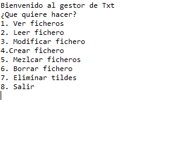
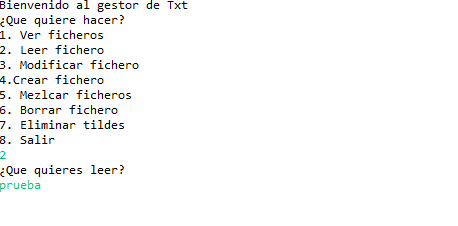
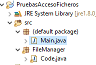

# GestorTXT

Es un pequeño programa de consola que permite administrar ficheros txt, pudiendo crearlos, añadir texto a los mismos, mezclarlos, borrarlos, eliminar las tildes, etc...

## Menu principal

Una vez iniciado el programa se mostrara un menu con todas las opciones posibles al usurio.

## Seleccion de ficheros

Cada vez que el usuario seleccione una opcion se le preguntare el nombre del fichero (o ficheros) sobre los que quiere actuar. El usuario no necesita incluir la extensión .txt al fichero ya que se sobreentiende. 

## Estructura del programa

El programa esta separado por un main que únicamente cuenta con un switch para las distintas opciones, el resto del programa se encuentra en el paquete FileManager, donde están todas las funciones.

